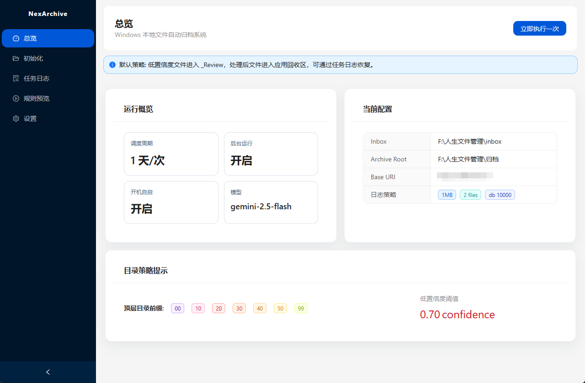
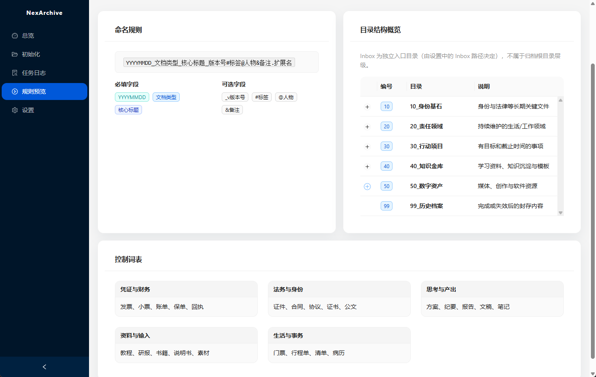
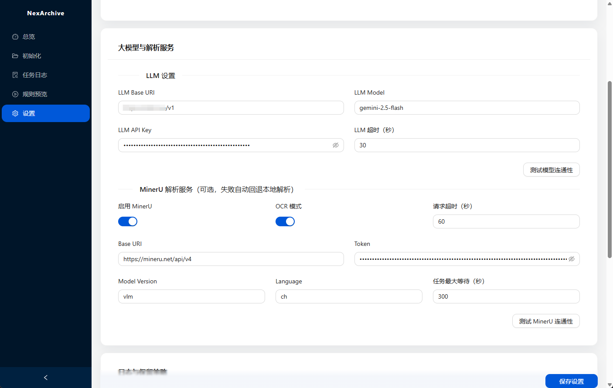

# NexArchive

[English](#english) | [中文](#中文)

---

<a id="english"></a>

## 🌐 English

NexArchive is an intelligent Windows desktop application designed for automated local file archiving and organization. It leverages the power of Local LLMs and advanced file extraction to seamlessly categorize, rename, and file your documents based on a controlled vocabulary and structured archive hierarchy.

### 🌟 Core Features

- **Automated Processing Pipeline**: Periodically scans your `Inbox` folder, performing type-based extraction, LLM-powered classification, and automated archiving without manual intervention.
- **Intelligent LLM Classification**: Uses OpenAI-compatible Chat Completions API to understand document semantics and assign appropriate tags, people involved, and context.
- **Advanced File Extraction**: Built-in support for processing a wide variety of formats (`pdf`, `docx`, `pptx`, `xlsx`, `md`, `png`, `jpg`, etc.) with both an optional high-accuracy MinerU API and a robust built-in Rust fallback.
- **Standardized Retitling & Routing**: Automatically renames files using the template `YYYYMMDD_文档类型_核心标题[#标签][@人物][&备注].扩展名` and routes them into standard top-level Chinese taxonomy folders (e.g., `10_身份基石`, `20_责任领域`, `30_行动项目`, `40_知识金库`, `50_数字资产`, `99_历史档案`).
- **Safety First**: Implements a dedicated in-app recycle bin (`%APPDATA%/NexArchive/recycle`) for source files, ensuring original files can be safely restored if needed. Unconfident classifications (`< 0.70`) or failures are routed to designated review folders, avoiding misfiling.
- **Local & Private**: No external runtime dependencies like Python or Tesseract needed. Operations run efficiently on your local system, with API keys safely encrypted.

### 📸 Highlights & Previews

**1. Dashboard Overview**
View system metrics, recent processing jobs, and real-time archiving status.



**2. Rule & Vocabulary Management**
View and manage the directory structure and vocabulary rules used by the LLM.



**3. Settings & Configuration**
Easily configure LLM connections, set up your Inbox/Archive root paths, and adjust extraction priorities.



### 🛠️ Development Guide

**Start in Development Mode**
Run the React frontend and Tauri backend together with live-reload:

```bash
npm install
npm run tauri dev
```

**Build the Installer (Windows)**
Create the final production `.msi` and `.exe` installers:

```bash
npm run tauri build
```

_Build outputs will be available at `src-tauri/target/release/bundle/msi/` and `src-tauri/target/release/bundle/nsis/`._

### 🚀 Release Workflow

The project uses a Tag-Driven release workflow. To trigger a new release via GitHub Actions (building and publishing release assets and updater metadata), simply create and push a version tag:

```bash
# Example: Releasing version v0.2.0
git tag v0.2.0
git push origin v0.2.0
```

_(Note: Ensure your `package.json` version and `tauri.conf.json` versions are bumped before tagging. Internal scripts like `npm run release:prepare` can assist with version and changelog prep)._

### 🔐 Updater Signing Setup

The built-in updater requires signed artifacts to ensure security. The GitHub release workflow requires the following repository secrets:

- `TAURI_SIGNING_PRIVATE_KEY`
- `TAURI_SIGNING_PRIVATE_KEY_PASSWORD`

**Generate keys locally (One-time setup):**

```bash
npm run tauri signer generate -w ~/.tauri/nexarchive.key
```

After generation, copy the output public key and replace the value in `src-tauri/tauri.conf.json` under `plugins.updater.pubkey`.

---

<a id="中文"></a>

## 🇨🇳 中文

NexArchive 是一款智能的 Windows 桌面应用程序，专为本地文件的自动归档和整理而设计。它利用本地大语言模型（LLMs）的强大功能和先进的文件内容解析提取技术，根据受控词表和结构化的归档目录层次，无缝地对您的文档进行分类、重命名并自动归档。

### 🌟 核心功能

- **自动化处理管线**：定期扫描您的 `Inbox` (收件箱) 文件夹，执行基于文件类型的提取、LLM 驱动的分类和自动归档，无需人工干预。
- **智能 LLM 分类**：使用兼容 OpenAI 的 Chat Completions API 来充分理解文档语义，并自动为您分配合适的标签、涉及人物和上下文信息。
- **高级文件内容提取**：内置支持处理多种格式（`pdf`、`docx`、`pptx`、`xlsx`、`md`、`png`、`jpg` 等），提供可选的高精度 MinerU API 提取和稳健的内置 Rust 原生解析后备方案。
- **标准化重命名与路由**：使用模板 `YYYYMMDD_文档类型_核心标题[#标签][@人物][&备注].扩展名` 自动重命名文件，并将其智能路由到标准的顶级分类文件夹中（例如，`10_身份基石`、`20_责任领域`、`30_行动项目`、`40_知识金库`、`50_数字资产`、`99_历史档案`）。
- **安全优先**：为源文件实现专用的应用内置回收站（位于 `%APPDATA%/NexArchive/recycle`），确保在需要时可以安全地恢复原始文件。对于置信度较低（`< 0.70`）或处理失败的分类，文件会被路由到指定的审查文件夹，避免错误归档。
- **本地化与隐私**：最终用户不需要安装 Python 或 Tesseract 等外部运行时依赖项。所有操作都在您的本地系统上高效、私密地运行，API 密钥也会被安全加密保存。

### 📸 核心亮点与预览

**1. 仪表盘概览**
查看系统指标、最近的处理任务以及实时的归档状态。


**2. 规则与词典管理**
查看和管理大语言模型所使用的目录结构及分类词汇规则。


**3. Settings & Configuration / 设置与配置**
轻松配置大模型参数和连接、统一管理您的收件箱/归档根目录路径，以及调整各个文件提取器的优先级。


### 🛠️ 开发指南

**以开发模式启动**
同时运行 React 前端和 Tauri 后端，支持热重载：

```bash
npm install
npm run tauri dev
```

**构建安装程序 (Windows)**
创建最终用于生产环境的 `.msi` 和 `.exe` 安装包：

```bash
npm run tauri build
```

_构建产物将输出在 `src-tauri/target/release/bundle/msi/` 和 `src-tauri/target/release/bundle/nsis/`。_

### 🚀 发布工作流

本项目采用基于 Tag (标签) 驱动的发布工作流。只需创建并推送一个新的版本标签，即可自动利用 GitHub Actions 触发新版本的构建（包含自动构建发布安装包资产以及生成 updater 所需的更新配置文件）：

```bash
# 例子：发布 v0.2.0 版本
git tag v0.2.0
git push origin v0.2.0
```

_(注：请在打标签之前确保 `package.json` 中的版本号和 `tauri.conf.json` 中的版本号已被正确更新发版。可以使用诸如 `npm run release:prepare` 这样的内部脚本来协助处理版本号和变更日志提取)_

### 🔐 自动更新程序签名设置

Tauri 内置的更新程序强制要求使用经过签名的产物以确保安全性。GitHub release 自动发布工作量需要在当前仓库（Repository）中配置以下 secrets 环境变量：

- `TAURI_SIGNING_PRIVATE_KEY`
- `TAURI_SIGNING_PRIVATE_KEY_PASSWORD`

**在本地生成密钥（仅需设置一次）：**

```bash
npm run tauri signer generate -w ~/.tauri/nexarchive.key
```

在使用命令行生成完毕后，复制命令行输出中的公钥（Public key），并将其覆盖替换至 `src-tauri/tauri.conf.json` 文件下的 `plugins.updater.pubkey` 字段中即可。
